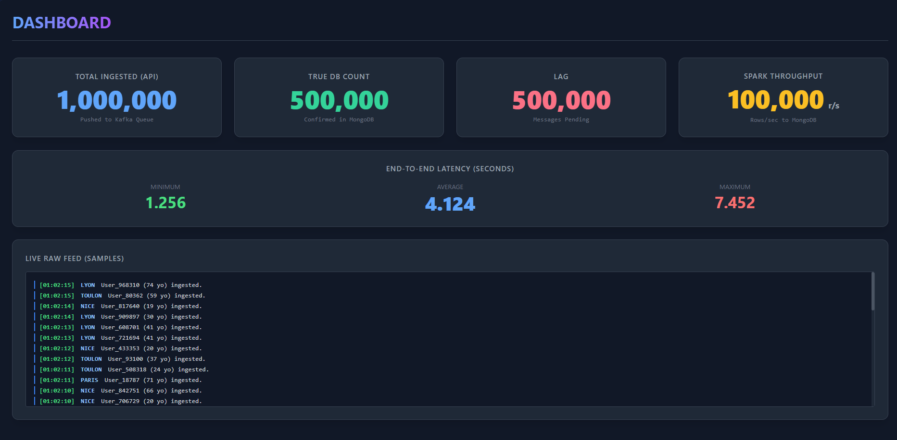

# Big Data Pipeline & Dashboard

A high-performance, data streaming and processing pipeline. This project demonstrates the ingestion, processing, storage, and visualization of massive amounts of simulated user data using modern big data technologies.



## Table of Contents
* Project Overview
* Architecture & Data Flow
* Tech Stack
* Prerequisites
* Quick Start Tutorial
* Makefile Commands
* Component Deep Dive
* Stress Testing
* Kafka Networking Details

---

## Project Overview
This pipeline is designed to simulate a high-throughput environment where thousands of user records are generated, ingested via an API, queued in a message broker, processed in micro-batches, saved to a database, and monitored via a live dashboard.

It handles everything from data generation to end-to-end latency calculations, completely containerized using Docker.

---

## Architecture & Data Flow
The project is split into two main logical environments: the Producer (load generation) and the Infrastructure (processing and storage).

* **Data Generation (Spark):** A PySpark job generates millions of fake user records and saves them as JSON shards into a shared volume.
* **Task Queuing (Redis):** As files are created, their paths are pushed to a Redis queue.
* **Data Dispatch (Python/AIOHTTP):** Multiple asynchronous Python HTTP workers pop files from Redis, read the JSON lines, attach a timestamp (`sent_at`), and send them in batches via HTTP POST to the Node.js API.
* **Ingestion (Node.js API):** The Express API receives the batches and publishes them to the Kafka `users` topic. It also emits a live feed of samples to the frontend via Socket.io.
* **Stream Processing (Spark Structured Streaming):** A Spark consumer listens to the `users` topic. Every batch interval, it:
  * Calculates end-to-end latency (current time - `sent_at`).
  * Writes the raw user data to MongoDB.
  * Computes performance metrics (throughput, min/max/avg latency) and publishes them back to a Kafka `metrics` topic.
* **Real-time Monitoring:** The Node.js API consumes the `metrics` topic and streams the aggregated data to the web dashboard using WebSockets.

---

## Tech Stack
* **Ingestion API:** Node.js, Express, KafkaJS, Socket.io
* **Message Broker:** Apache Kafka (KRaft mode, no Zookeeper)
* **Stream Processing:** Apache Spark (PySpark), Spark Structured Streaming
* **Database:** MongoDB
* **Job Queueing (Producer):** Redis, Python aiohttp
* **Frontend Dashboard:** HTML5, Tailwind CSS, Socket.io-client
* **Containerization:** Docker & Docker Compose

---

## Prerequisites
* Docker and Docker Compose installed.
* Make installed.

---

## Quick Start Tutorial
Follow these steps to launch the pipeline on your local machine:

### 1. Configure the Environment
Clone the repository and create your environment file:

```bash
cp .env_example .env
```

**CRITICAL STEP:** Open `.env` and configure `API_ADDR`.
Because the Producer and Infrastructure run in separate Docker Compose stacks, the Producer HTTP workers need to know your host machine's IP address to reach the API.

* Find your local IPv4 address (e.g., `192.168.1.x`).
* Update the `.env` file: `API_ADDR=http://192.168.1.55` (replace with your actual IP).

### 2. Launch the Infrastructure
Start the Kafka broker, MongoDB, API, and the Spark Consumer cluster:

```bash
make infra-up
```

Wait a few moments for Kafka to initialize its topics and the Spark Consumer to be fully ready.
You can view the dashboard by opening your browser to: http://localhost:3000

### 3. Launch the Data Producer
Start the Spark data generator and the HTTP workers:

```bash
make producer-up
```

Once launched, the Spark master will generate data shards. The Python HTTP workers will automatically start reading these shards and firing them at your API.
Watch the dashboard come alive with real-time metrics!

### 4. Stop the Pipeline
To completely shut down and clean up:

```bash
make down
```

---

## Makefile Commands
The makefile centralizes all Docker operations. Here is a breakdown of what each command does:

| Command | Description |
| :--- | :--- |
| `make up` | Boots up the entire project (`infra-up` followed by `producer-up`). |
| `make down` | Shuts down the entire project and cleans up the Spark data volume. |
| `make infra-up` | Starts the API, Kafka, MongoDB, and Spark Consumer stack in the background. |
| `make infra-down` | Stops and removes the infrastructure containers. |
| `make infra-rebuild` | Rebuilds the Docker images for the infrastructure (e.g., if you updated the Node.js API). |
| `make producer-up` | Starts the Spark generator, Redis, and HTTP workers. |
| `make producer-down` | Stops the producer containers and runs a temporary Alpine container to wipe the generated data in the `spark-data-volume` to ensure a clean slate for the next run. |
| `make producer-rebuild` | Rebuilds the producer Docker images (e.g., if you updated the HTTP worker script). |
| `make stress-test` | Executes a script to test system resilience (see Stress Testing section). |

---

## Component Deep Dive

### 1. Producer (/producer)
* **Spark Generator:** Configured via `NUM_ROWS` and `NUM_SHARDS` in `.env`. It creates a massive DataFrame of random users and writes them as JSON parts to a shared Docker volume.
* **Redis:** Acts as a simple locking mechanism and queue so that multiple HTTP workers don't read the same file simultaneously.
* **HTTP Workers:** Scalable Python containers running asyncio and aiohttp. They process files in batches, add a high-precision `sent_at` timestamp, and push data to the Node API. Controlled by `HTTP_WORKERS_REPLICAS` and `HTTP_WORKERS_CONCURRENCY`.

### 2. The API (/api)
* Acts as a gateway. It accepts large JSON arrays at `/users/batch` and pushes them efficiently to Kafka using Kafkajs.
* Hosts the web dashboard static files (`/public`).
* Runs a separate Kafka consumer in the background listening to the `metrics` topic to feed the frontend via WebSockets.

### 3. Infrastructure (/infra)
* **Kafka:** Set up in KRaft mode (modern Kafka without Zookeeper). It uses an init container (`kafka-init.sh`) to automatically create the `users` and `metrics` topics with partitioned configurations based on the `.env` file.
* **MongoDB:** The final resting place for the generated user data.
* **Spark Consumer:** A Spark Structured Streaming application (`consumer.py`). It reads micro-batches from Kafka, computes the delta between `created_at` (now) and `sent_at` (from the HTTP worker) to determine latency. It writes records to MongoDB and sends aggregated statistics (throughput, max/min/avg latency) back to Kafka.

---

## Stress Testing
Want to see how your pipeline handles a massive backlog?

1. Ensure the pipeline is running (`make up`).
2. Run the stress test:

```bash
make stress-test
```

What happens? The script pauses the `spark-submitter` container (the consumer).
Meanwhile, the HTTP workers will continue to hammer the API, causing the Kafka `users` topic to build up a massive lag. You will see the "Lag" counter on the dashboard spike.

Press `Ctrl+C` in your terminal. The script will catch the signal and unpause the consumer.
Watch the dashboard as Spark processes a massive catch-up batch, causing the "Spark Throughput" metrics to skyrocket!

---

## Kafka Networking Details
Kafka runs inside Docker but might need to be accessed from the host machine (e.g., running Spark locally instead of via Docker). To accommodate this, Kafka is configured with three distinct listeners:

* **INTERNAL (Port 29092):** Used by containers within the Docker network (e.g., the Node.js API).
* **EXTERNAL (Port 9092):** Exposed to your host machine (`localhost:9092`). Use this if you are running local scripts outside of Docker.
* **CONTROLLER (Port 9093):** Strictly for Kafka's internal cluster management (KRaft consensus).

*(See `infra/kafka.md` for more details).*